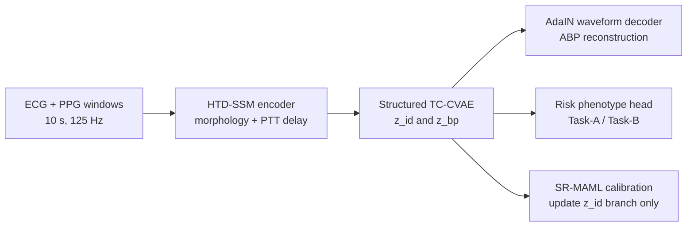
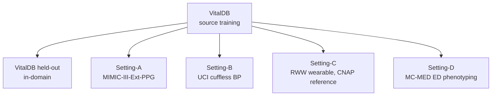

# Meta-Fingerprint

PyTorch implementation of **Meta-Fingerprint: Physics-Grounded Vascular
Disentanglement for Generalizable Cross-Domain Hemodynamic Monitoring**.

Meta-Fingerprint is a research codebase for cross-domain cuffless
hemodynamic monitoring from synchronized ECG and PPG. The repository includes
the model implementation, training and evaluation scripts, structural-subspace
calibration, preprocessing utilities, synthetic smoke tests, split-manifest
templates, and reviewer-facing documentation. The private RWW wearable cohort
is not redistributed because it is governed by a data-use agreement; the code
uses the same NPZ schema and split format for public and approved private data.

This release is intended to make the manuscript protocol executable, not to
serve as a clinical device or diagnostic tool.

## Model at a Glance



The implementation follows the paper structure:

| Component | Code | Purpose |
|---|---|---|
| HTD-SSM encoder | `src/metafingerprint/models/htd_ssm.py` | ECG-PPG morphology encoding with bounded fractional delay |
| Neural ODE front end | `src/metafingerprint/models/ode.py` | Local continuous-time morphology extraction |
| Structured latent encoder | `src/metafingerprint/models/latents.py` | Separates `z_id` and `z_bp` through asymmetric routing |
| AdaIN waveform decoder | `src/metafingerprint/models/decoder.py` | Reconstructs ABP with structural conditioning |
| TC-CVAE losses | `src/metafingerprint/losses.py` | Reconstruction, MI, TC, marginal KL, temporal consistency |
| SR-MAML calibration | `src/metafingerprint/adaptation.py` | Few-shot structural-branch adaptation |
| Evaluation | `src/metafingerprint/evaluation.py` | Waveform, scalar BP, delay, and phenotype metrics |

## Evaluation Protocol



| Setting | Source | Target | Reference | Task scope | Reporting rule |
|---|---|---|---|---|---|
| In-domain | VitalDB | VitalDB held-out | invasive ABP | Track-1 + Track-2 | source test split |
| Setting-A | VitalDB | MIMIC-III-Ext-PPG | invasive ABP | Track-1 + Track-2 | external ABP-equipped transfer |
| Setting-B | VitalDB | UCI cuffless BP | invasive/reference BP waveform | Track-1 + proxy Track-2 | external transfer; proxy labels reported separately |
| Setting-C | VitalDB | RWW | CNAP non-invasive reference | Track-1 + proxy Track-2 | 32-fold LOSO; not an AAMI compliance test |
| Setting-D | VitalDB | MC-MED | no continuous ABP | zero-shot Track-2 | three-class ICD-10 ED phenotyping |

AAMI-style scalar BP tolerance flags are meaningful only for ABP-equipped
Settings A-B. Setting-C is reported as CNAP-referenced wearable transfer.

## Public Data Sources

The repository does not redistribute third-party datasets. Download each public
dataset from its original source, follow its license, and convert the data to
the NPZ format below.

| Dataset | Manuscript role | Public access |
|---|---|---|
| VitalDB | sole training source and in-domain test | https://vitaldb.net |
| MIMIC-III-Ext-PPG | Setting-A external ABP-equipped transfer | https://doi.org/10.13026/nmwb-6h34 |
| UCI cuffless BP / PPG-BP | Setting-B external transfer | https://archive.ics.uci.edu/dataset/340/cuff+less+blood+pressure+estimation |
| MC-MED | Setting-D zero-shot emergency-department phenotyping | https://doi.org/10.13026/jz99-4j81 |
| RWW | private wearable/CNAP transfer | not redistributed; use only under approved data-use agreement |

Dataset-specific notes are in `docs/data_access.md`.

## Repository Layout

```text
.
|-- configs/                 # paper-style and task-specific YAML configs
|-- docs/                    # data access, paper mapping, reproducibility notes
|-- examples/manifests/      # split and setting protocol CSV templates
|-- scripts/                 # train/evaluate/calibrate/predict/preprocess CLIs
|-- scripts/figures/         # aggregate-metric plotting utilities
|-- src/metafingerprint/     # package source
|   |-- data/                # NPZ loaders, preprocessing, synthetic data
|   |-- models/              # HTD-SSM, latent encoder, decoder
|   |-- losses.py            # TC-CVAE and task losses
|   |-- adaptation.py        # structural-subspace calibration
|   `-- evaluation.py        # metric computation
|-- artifacts/               # aggregate metrics only, no raw private data
|-- figures/                 # generated figure outputs
|-- model_zoo/               # releasable checkpoints, if permitted
|-- splits/                  # review-safe split manifests
`-- tests/                   # unit and smoke tests
```

The small README files in `artifacts/`, `figures/`, `model_zoo/`, and `splits/`
are intentional. They keep the directories visible in Git and document what is
allowed to be placed there.

## Installation

```bash
# Anonymous review mirror:
# https://anonymous.4open.science/r/Meta-Fingerprint-DF31/
cd Meta-Fingerprint
python -m venv .venv
source .venv/bin/activate        # Windows: .venv\Scripts\activate
python -m pip install --upgrade pip
pip install -e .[dev,csv,metrics]
```

For CUDA training, install the PyTorch build matching your CUDA version before
installing the project.

## Quick Start

Run a synthetic smoke test:

```bash
python scripts/synthetic_smoke.py --out runs/smoke
```

Run unit tests:

```bash
pytest -q
```

The smoke test creates a small synthetic ECG/PPG/ABP dataset, trains one CPU
epoch with `configs/debug.yaml`, writes a checkpoint, and reports waveform,
classification, and delay metrics. It is a code-path check; it does not
reproduce the manuscript numbers.

## Data Format

The loader accepts either a directory with `train.npz`, optional `val.npz` and
`test.npz`, or a single NPZ with a `split` key. The paper protocol uses
non-overlapping 10-second windows at 125 Hz, so the default sequence length is
`L = 1250`.

Recommended NPZ format:

```python
np.savez_compressed(
    "train.npz",
    signals=signals.astype("float32"),  # [N, 2, L] or [N, L, 2], ECG then PPG
    abp=abp.astype("float32"),          # optional [N, L]
    labels=labels.astype("int64"),      # optional [N], -1 means missing label
    patient_id=patient_ids,             # optional [N]
    domain=domain_ids,                  # optional [N]
    split=split_names,                  # optional train / val / test
)
```

Compatibility format:

```python
np.savez_compressed(
    "windows.npz",
    ecg=ecg_windows.astype("float32"),  # [N, L]
    ppg=ppg_windows.astype("float32"),  # [N, L]
    abp=abp_windows.astype("float32"),  # optional [N, L]
    label=labels.astype("int64"),       # optional [N]
    patient_id=patient_ids,             # optional [N]
    split=split_names,                  # optional train / val / test
)
```

### Task Labels

For ABP-equipped cohorts (VitalDB, MIMIC-III-Ext-PPG, UCI, RWW), use the
four-class Task-B configuration:

```python
from metafingerprint.data import bp_scalar_labels_4class

labels = bp_scalar_labels_4class(abp_windows)  # [N, L] -> [N] in {0,1,2,3}
```

For MC-MED (Setting-D, no ABP waveform), construct visit-level three-class
labels from ICD-10 code families as described in `docs/data_access.md`, save
them under the `labels` key, and use `configs/default.yaml` or
`configs/task_b_3class.yaml`.

## Training and Evaluation

Train on the source cohort:

```bash
python scripts/train.py \
  --data data/vitaldb_windows \
  --config configs/default.yaml \
  --output runs/vitaldb_metafingerprint \
  --device cuda:0
```

Evaluate on an external target cohort:

```bash
python scripts/evaluate.py \
  --data data/mimic_setting_a_windows \
  --checkpoint runs/vitaldb_metafingerprint/best.pt \
  --split test \
  --device cuda:0
```

Evaluate a held-out subject with structural-subspace calibration:

```bash
python scripts/calibrate.py \
  --support data/rww_subject_001_support.npz \
  --query data/rww_subject_001_query.npz \
  --checkpoint runs/vitaldb_metafingerprint/best.pt \
  --device cuda:0 \
  --inner-steps 3 \
  --inner-lr 0.01
```

Support and query windows must be disjoint. The calibration routine freezes
the shared modules and updates only `model.structural_encoder`.

## CSV to NPZ Conversion

```bash
python scripts/prepare_npz_from_csv.py \
  --csv data/raw_stream.csv \
  --out data/windows.npz \
  --source-fs 500 \
  --target-fs 125 \
  --window-sec 10
```

Required CSV columns are `ecg` and `ppg`. Optional columns are `abp`,
`patient_id`, `label`, and `domain`. When `source-fs` is higher than
`target-fs`, the converter applies a sixth-order Chebyshev anti-aliasing
filter before resampling. It also applies a basic finite/flat-line/pressure
range quality filter by default; pass `--no-quality-filter` only for debugging.

## Documentation for Reviewers

| File | Purpose |
|---|---|
| `docs/data_access.md` | cohort roles, data-use limits, label conventions |
| `docs/reproducibility.md` | commands for public and controlled-access reproduction |
| `docs/paper_mapping.md` | mapping from manuscript components to source files |
| `docs/result_artifacts.md` | expected aggregate artifacts for tables and figures |
| `examples/manifests/` | split and Setting A-D protocol templates |

No raw private RWW signals, restricted subject-level metadata, or checkpoints
derived from restricted RWW support/query data are included in this public
repository.

## Planned Deployment Software

We plan to add a lightweight deployment package after the review version is
frozen. The planned software will sit on top of the current backend and will
not change the paper results.

Planned modules:

- ECG/PPG window quality check and NPZ export.
- Waveform reconstruction and scalar BP summary viewer.
- Structural-subspace calibration interface for approved support/query data.
- Confidence-warning visualization for deployment stress analysis.
- Export of aggregate metrics suitable for `artifacts/` and figure scripts.

The deployment software is not a medical device and is not intended for
clinical decision making. Until it is released, the command-line scripts in
`scripts/` are the supported interface.

## Citation

If you use this code, please cite the associated Meta-Fingerprint manuscript.
The software citation metadata are provided in `CITATION.cff`.

## License

MIT.
