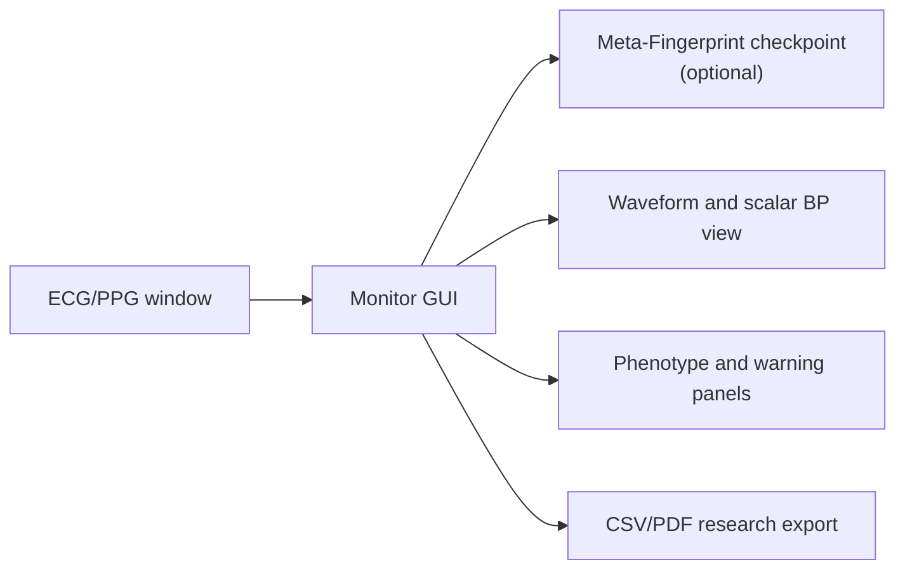

# Meta-Fingerprint Monitor

Meta-Fingerprint Monitor is a desktop host-computer prototype for reviewing
ECG/PPG windows, running Meta-Fingerprint inference, exporting aggregate
results, and generating research reports. It is included as a preview of the
planned deployment software described in the manuscript.

The monitor can run with a trained checkpoint or in simulation mode. Simulation
mode uses synthetic physiological signals so that reviewers can inspect the
interface without restricted clinical data or private model weights.



## Quick Start

```bash
cd monitor
python -m pip install -r requirements_gui.txt
python main.py
```

On Windows, `run.bat` launches the same entry point. If no checkpoint is loaded,
the monitor starts in simulation mode.

## Panels

| Panel | Purpose |
|---|---|
| Dashboard | Session summary, recent measurements, and runtime status |
| Monitor | ECG/PPG/ABP waveform display and live inference output |
| Analysis | Batch NPZ processing, aggregate metrics, and CSV export |
| Patients | Local SQLite patient registry and session history |
| LAN | TCP server for streaming ECG/PPG windows from an acquisition client |
| Reports | PDF report generation for research review |
| Settings | Checkpoint loading, device selection, and AAMI threshold display |

## LAN Data Format

The TCP server listens on port `50505` by default. A client sends a framed
message with the magic header `MFPX`, JSON metadata, and two float32 arrays
ordered as ECG then PPG.

```python
import json
import socket
import struct

import numpy as np

MAGIC = b"MFPX"
MSG_DATA = 0x01


def send_window(sock, ecg, ppg, patient_id="P001", fs=125.0):
    n = len(ecg)
    meta = json.dumps({"patient_id": patient_id, "fs": fs, "n_samples": n}).encode()
    arr = np.stack([ecg, ppg], axis=0).astype("float32").tobytes()
    payload = struct.pack("!I", len(meta)) + meta + arr
    header = struct.pack("!4sIHH", MAGIC, len(payload), 1, MSG_DATA)
    sock.sendall(header + payload)


with socket.socket() as s:
    s.connect(("127.0.0.1", 50505))
    send_window(s, ecg_array, ppg_array)
```

## Model Integration

Load a trained checkpoint from the sidebar **Load Model** button or from
`Settings > Model Configuration > Load checkpoint`. Checkpoints should follow
the repository training format and contain `model_state_dict`; if a serialized
configuration is present, it is used to rebuild the model.

Without a checkpoint, all panels remain available in simulation mode. Simulation
outputs are for interface testing only and should not be reported as manuscript
results.

## Build Executable

```bash
cd monitor
python -m pip install -r requirements_gui.txt
python -m pip install pyinstaller
pyinstaller build_exe.spec --clean
```

The Windows helper `build_exe.bat` runs the same steps and writes the executable
to `dist/MetaFingerprintMonitor/MetaFingerprintMonitor.exe`.

## Clinical Scope

This monitor is a research prototype, not a medical device or diagnostic
system. AAMI SP10 flags in the interface apply only to ABP-equipped Settings
A-B in the manuscript protocol. Setting-C is CNAP-referenced wearable transfer
and is not an AAMI compliance test.
